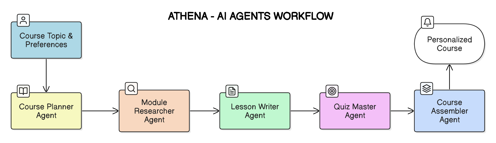

# Athena - Azure Function App

This is an Azure Function App that integrates Azure OpenAI services, AI Agents and web search tools to provide enriched search results and generate courses based on those results.

---

## AI AGENT WORKFLOW

Athena employs a collaborative AutoGen workflow:

1.  **User Input:** Collect the course topic and preferences.
2.  **Planning:** `Course Planner Agent` outlines the course structure.
3.  **Research:** `Module Research Agent` gathers information using web search tools.
4.  **Writing:** `Lesson Writer Agent` drafts lesson content tailored to preferences.
5.  **Quiz Gen:** `Quiz Master Agenet` creates quizzes quizzes of multi-choice or true/false format and other kinds of active learning activities based on lesson content.
9.  **Assembly:** `Course Assembler Agent` manages revisions (if needed) and assembles the final course.
7. **Output:** User is presented with the final course.



---


## API Contract

<table>
  <thead>
    <tr>
      <th>API</th>
      <th>REQUEST</th>
      <th>RESPONSE</th>
    </tr>
  </thead>
  <tbody>
    <tr>
      <td><strong>POST /generate_course</strong></td>
      <td>
        <pre><code>{
  "userId": "string",
  "topic": "string",
  "preferences" : {
    "level": "BEGINNER",
    "duration": "SHORT",
    "focus": "BROAD"
  }
}</code></pre>
      </td>
      <td><pre><code>{
  "message": "Success or error message"
}</code></pre>
        </td>
    </tr>
  </tbody>
  <table>


---

## Prerequisites

- Python 3.9.12 or later
- Azure Functions Core Tools
- Azure Subscription
- Web Search API Key
- Azure OpenAI API Key

## Local Setup

1. Create a virtual environment and activate it:
    ```sh
    python -m venv .venv
    .venv\Scripts\activate  # On Windows
    source .venv/bin/activate  # On macOS/Linux
    ```

2. Install the required packages:
    ```sh
    pip install -r requirements.txt
    ```

3. Set up your local settings:
    - Create a [local.settings.json](http://_vscodecontentref_/0) file in the root directory with the following content:
    ```json
    {
        "IsEncrypted": false,
        "Values": {
            "AzureWebJobsStorage": "UseDevelopmentStorage=true",
            "FUNCTIONS_WORKER_RUNTIME": "python",
            "AZURE_GPT_4O_MINI_API_KEY": "<your-api-key>",
            "AZURE_GPT_4O_MINI_ENDPOINT": "<your-end-point>",
            "AZURE_O3_MINI_API_KEY": "<your-api-key>",
            "AZURE_O3_MINI_ENDPOINT": "<your-end-point>",
            "ATHENA_URL": "http://localhost:3000"
        }
    }
    ```

4. Change the model_client in `selector/athena_multi_agents.py` as per the requirement.

## Running the Function App

1. Start the Azure Functions runtime:
    ```sh
    func start
    ```

2. The function app should now be running locally. You can test it by sending HTTP requests to the endpoint.

## Usage

- The function app exposes an HTTP endpoint that can be triggered with a `query` parameter.
- The app uses Multiple AI Agents & Web Search API to fetch search results and Azure OpenAI to generate the courses based on those results.

---