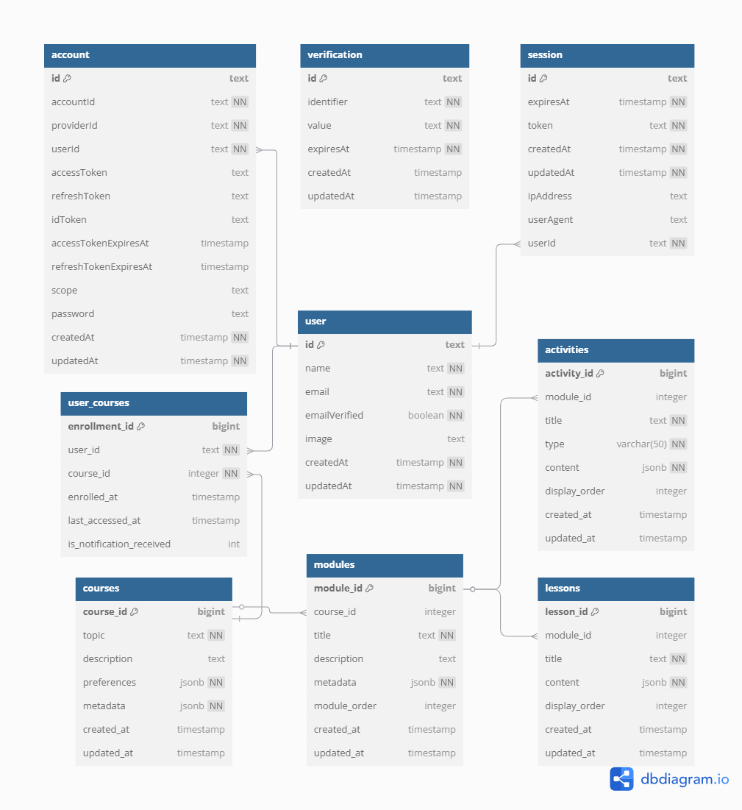

# DATABASE SCHEMA

The database schema for Athena is designed to support modular course generation, user preferences, and progress tracking.

---

## Schema Diagram

---

## Tables Overview

### Courses Table
- **Purpose:** Stores course details, preferences, and metadata.
- **Columns:**
  - `course_id`: Primary key.
  - `topic`: Course topic.
  - `description`: Course description.
  - `preferences`: JSONB storing user preferences (level, duration, focus).
  - `metadata`: JSONB storing course metadata (e.g., module/lesson/activity counts).
  - `created_at`: Timestamp of creation.
  - `updated_at`: Timestamp of last update.

### Modules Table
- **Purpose:** Stores module details for each course.
- **Columns:**
  - `module_id`: Primary key.
  - `course_id`: Foreign key referencing `courses`.
  - `title`: Module title.
  - `description`: Module description.
  - `metadata`: JSONB storing module metadata.
  - `module_order`: Order of the module in the course.
  - `created_at`: Timestamp of creation.
  - `updated_at`: Timestamp of last update.

### Lessons Table
- **Purpose:** Stores lesson details for each module.
- **Columns:**
  - `lesson_id`: Primary key.
  - `module_id`: Foreign key referencing `modules`.
  - `title`: Lesson title.
  - `content`: JSONB storing lesson content.
  - `display_order`: Order of the lesson in the module.
  - `created_at`: Timestamp of creation.
  - `updated_at`: Timestamp of last update.

### Activities Table
- **Purpose:** Stores activity details for each module.
- **Columns:**
  - `activity_id`: Primary key.
  - `module_id`: Foreign key referencing `modules`.
  - `title`: Activity title.
  - `type`: Type of activity (e.g., quiz).
  - `content`: JSONB storing activity content.
  - `display_order`: Order of the activity in the module.
  - `created_at`: Timestamp of creation.
  - `updated_at`: Timestamp of last update.

### User Courses Table
- **Purpose:** Tracks user enrollment in courses.
- **Columns:**
  - `enrollment_id`: Primary key.
  - `user_id`: Foreign key referencing `user`.
  - `course_id`: Foreign key referencing `courses`.
  - `enrolled_at`: Timestamp of enrollment.
  - `last_accessed_at`: Timestamp of last access.

---

For more details, refer to the schema diagram above.
