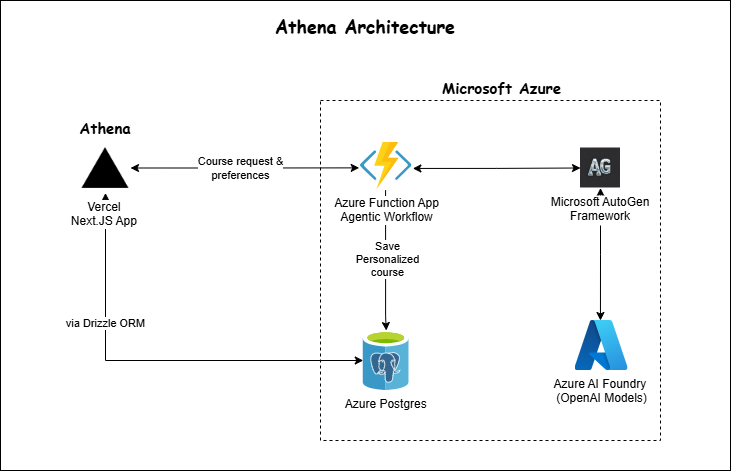

# Athena - Next.JS

Official frontend & backend repository for Athena.

---

## SYSTEM ARCHITECTURE

---

## Front End flow

### Landing
- Trending Courses/Modules
- Login (Better Auth)

### Homepage
- Build custom course (AI Generated)
- Load user courses (Generated courses)
- Load user modules (Modules under user courses)
- Search courses option (Future Enhancement)

### Build Custom Course (Azure Function API call)
- User inputs the course topic
- User selects the following:
  - Level: BEGINNER, INTERMEDIATE, ADVANCED
  - Duration: SHORT, MEDIUM, LONG
  - Focus: IN-DEPTH, BROAD
- Toast: Course generated started successfully.
- Once generated the course will be available in "Your courses" Section.

### Course Page
- List the modules 
- List the lessons & activities (quizzes)

---

## Backend API Contracts
<table>
  <thead>
    <tr>
      <th>API</th>
      <th>Description</th>
      <th>REQUEST</th>
      <th>RESPONSE</th>
    </tr>
  </thead>
  <tbody>
    <tr>
      <td><strong>GET /api/v1/courses</strong></td>
      <td>List all courses</td>
      <td>None</td>
      <td>
        <pre><code>[
  {
    "courseId": "BIGINT",
    "title": "string",
    "description": "string",
    "preferences": {
      "level": "BEGINNER",
      "duration": "SHORT",
      "focus": "IN-DEPTH"
    },
    "metadata": {
      "count": {
        "modules": 3,
        "lessons": 10,
        "activities": 5
      }
    }
  }
]</code></pre>
      </td>
    </tr>
    <tr>
      <td><strong>GET /api/v1/{user_id}/courses</strong></td>
      <td>All courses associated with user</td>
      <td>None</td>
      <td>
        <pre><code>[
  {
    "courseId": "BIGINT",
    "title": "string",
    "description": "string",
    "preferences": {
      "level": "BEGINNER",
      "duration": "SHORT",
      "focus": "IN-DEPTH"
    },
    "metadata": {
      "count": {
        "modules": 3,
        "lessons": 10,
        "activities": 5
      }
    }
  }
]</code></pre>
      </td>
    </tr>
    <tr>
      <td><strong>GET /api/v1/{user_id}/modules</strong></td>
      <td>All modules under the courses of users</td>
      <td>None</td>
      <td>
        <pre><code>[
  {
    "courseId": "BIGINT",
    "courseTopic": "string",
    "moduleId": "BIGINT",
    "moduleDescription": "string",
    "preferences": {
      "level": "BEGINNER",
      "duration": "SHORT",
      "focus": "IN-DEPTH"
    }
  }
]</code></pre>
      </td>
    </tr>
    <tr>
      <td><strong>GET /api/v1/courses/trending</strong></td>
      <td>Trending courses in the platform (Limit 5)</td>
      <td>Path Param: <code>user_id</code></td>
      <td>
        <pre><code>[
  {
    "courseId": "BIGINT",
    "title": "string",
    "description": "string",
    "preferences": {
      "level": "BEGINNER",
      "duration": "SHORT",
      "focus": "IN-DEPTH"
    },
    "metadata": {
      "count": {
        "modules": 3,
        "lessons": 10,
        "activities": 5
      }
    }
  }
]</code></pre>
      </td>
    </tr>
    <tr>
      <td><strong>GET /api/v1/modules/trending</strong></td>
      <td>Trending modules across courses (Limit 5)</td>
      <td>None</td>
      <td>
        <pre><code>[
  {
    "courseId": "BIGINT",
    "courseTopic": "string",
    "moduleId": "BIGINT",
    "moduleDescription": "string",
    "preferences": {
      "level": "BEGINNER",
      "duration": "SHORT",
      "focus": "IN-DEPTH"
    }
  }
]</code></pre>
      </td>
    </tr>
    <tr>
      <td><strong>GET /api/v1/courses/id/{course_id}</strong></td>
      <td>Complete course including its modules, lessons, and activities.</td>
      <td>Path Param: <code>course_id</code></td>
      <td>
        <pre><code>{
  "courseId": "BIGINT",
  "title": "string",
  "description": "string",
  "preferences": {
    "level": "BEGINNER",
    "duration": "SHORT",
    "focus": "IN-DEPTH"
  },
  "metadata": {
    "count": {
      "modules": 3,
      "lessons": 10,
      "activities": 5
    }
  },
  "modules": [
    {
      "moduleId": "BIGINT",
      "title": "string",
      "description": "string",
      "content": [
        {
          "lessonId": "BIGINT",
          "title": "string",
          "description": "string",
          "content": {
            "type": "MARKDOWN",
            "value": "&lt;markdown&gt;"
          }
        },
        {
          "activityId": "BIGINT",
          "title": "string",
          "type": "&lt;quiz&gt;",
          "content": {
            "type": "MARKDOWN",
            "value": "&lt;markdown&gt;"
          }
        }
      ]
    }
  ]
}</code></pre>
      </td>
    </tr>
    <tr>
      <td><strong>POST /api/v1/course/generate</strong></td>
      <td>Generate a new course based on the provided topic and user preferences.</td>
      <td>
        <pre><code>{
  "userId": "string",
  "topic": "string",
  "preferences" : {
    "level": "BEGINNER",
    "duration": "SHORT",
    "focus": "BROAD"
  }
}</code></pre>
      </td>
      <td>Returns generated course ID</td>
    </tr>
  </tbody>
</table>

---
